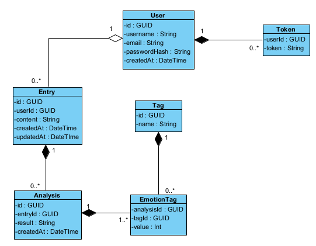

# VibeNote
## Команда 2.2
### Студенты:
### 
* [Гордеева Ольга](https://github.com/duffiwer/) - Team Lead, аналитик
* [Галсанов Булат](https://github.com/Readiee/) - Front-end разработчик, Дизайнер/UX-специалист
* [Капанин Дмитрий](https://github.com/ClwnYeti/) - Back-end разработчик
* [Власова Катерина](https://github.com/kate1234567/) - Back-end разработчик, Front-end разработчик
### Тема
Мобильное приложение для отслеживания и анализа эмоционального состояния.
### Описание проекта
Приложение позволяет фиксировать переживания в формате текстовых дневниковых записей. 
VibeNote реализует интеграцию ИИ-сервиса, который анализирует текст, находит в нем эмоциональные паттерны, триггерные слова, а также дает рекомендации для улучшения самочувствия.
### Сервисы командной разработки
###
* [Jira](https://vibenote.atlassian.net/jira/software/projects/VD/boards/2)
* [Figma]()  в разработке
###
  Для проверяющего yeticrazy505@gmail.com:q1w2e4r5t6y7
### Презентация проекта
#### Структура базы данных
  
Версия 0.0.1
#### Описание API
[YAML файл api](sources/openapi.yaml)  
Версия 0.0.1
### Документация
###
* [ТЗ](https://drive.google.com/file/d/1SUhNhrmwD9bmNEXAi_tsTpqTMhptm6IR/view?usp=sharing)
* [Предпроектное исследование](https://drive.google.com/file/d/1dWx-IMSPN8mDc9oY7GV2tXZ16IUafDv-/view?usp=sharing)
* [OKR](https://drive.google.com/file/d/1ItsxCKEzz1SkJlatEYLo-2SVJoCTJQJ2/view?usp=sharing)
* [User Stories](https://drive.google.com/file/d/1zcQbhzrTNIVu7Wm49FaxXAMRn2HvxNxw/view?usp=sharing)
